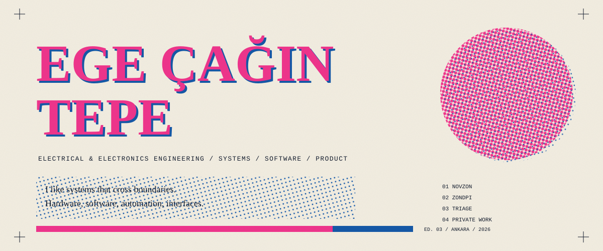

# Profile v3 — Hero Studies

These are three deliberately different visual directions for the profile. None of them use the previous dashboard / telemetry aesthetic.

## A — Swiss Editorial

  

**Idea:** visible 12-column grid, off-white stock, oversized grotesk typography, one red accent, strong asymmetry.

**Why it works:** feels designed rather than generated. The layout has a real graphic-design constraint and very little decoration.

---

## B — Blueprint / Drafting

  

**Idea:** engineering drawing conventions: assembly axis, numbered callouts, dimensions, title block, revision and sheet metadata.

**Why it works:** directly connects the profile to engineering without using fake dashboards or sci-fi UI language.

---

## C — Risograph Poster

  

**Idea:** two spot inks, deliberate 4px misregistration, halftone screens, paper grain and registration marks.

**Why it works:** the imperfections make it feel printed and human rather than digitally over-polished.

---

The profile README currently uses **A — Swiss Editorial**.
