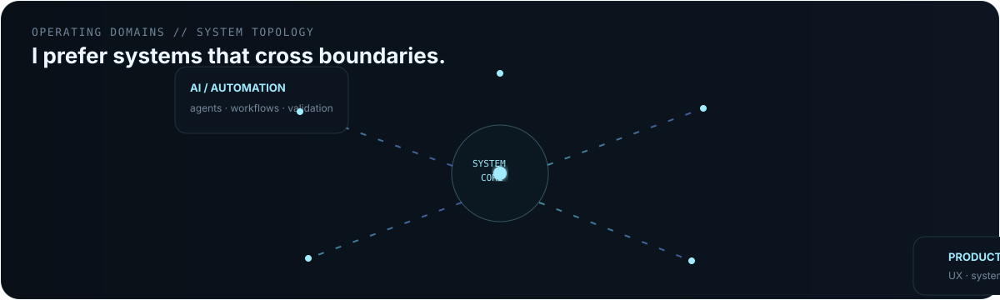
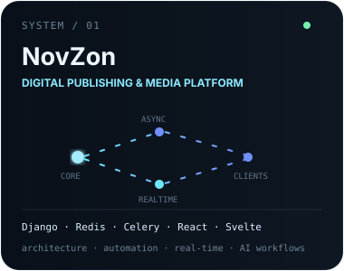
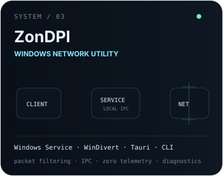
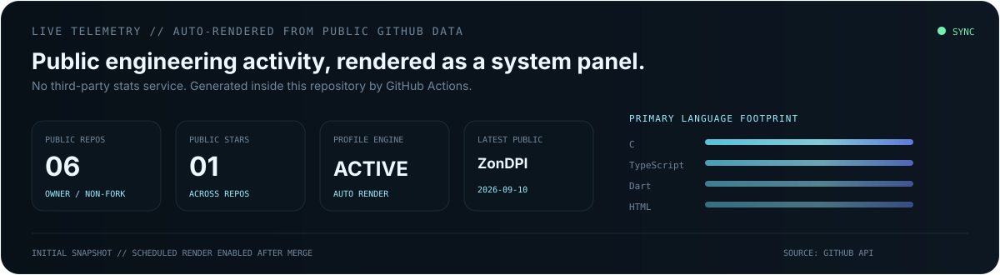
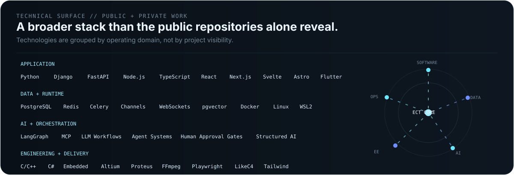
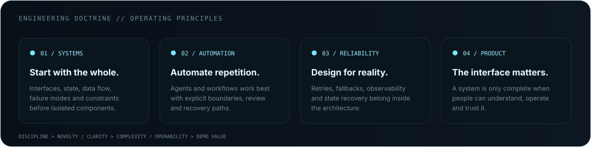
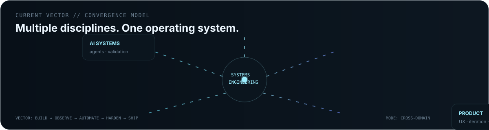

<picture>
  <source media="(prefers-color-scheme: dark)" srcset="./assets/hero-dark.svg">
  <source media="(prefers-color-scheme: light)" srcset="./assets/hero-light.svg">
  
</picture>

[LinkedIn](https://www.linkedin.com/in/egecagintepe/) ·
[Email](mailto:napryzon@gmail.com) ·
[Public Systems](#01--selected-systems) ·
[Technical Surface](#03--technical-surface)

Electrical & Electronics Engineering · Systems · Software · Automation · Product

 

  

 

## 01 // SELECTED SYSTEMS

  
  
  

Public repositories are the visible edge of a broader engineering workspace spanning platform architecture,
automation, infrastructure, AI systems, networking and product development.

 

## 02 // LIVE TELEMETRY

  

Generated inside this repository from public GitHub data. No external stats-card service in the critical path.

 

## 03 // TECHNICAL SURFACE

  

> The technology map reflects tools used across both public and private engineering work. Private source code, internal repository names, credentials, proprietary workflows and implementation-sensitive details remain private.

 

## 04 // ENGINEERING DOCTRINE

  

 

## 05 // CURRENT VECTOR

  

Current direction: connecting software, infrastructure, AI-assisted workflows and electrical-engineering fundamentals into systems that can actually be operated.

 

## 06 // SIGNAL

  

### BUILD / OBSERVE / ITERATE / HARDEN

[LinkedIn](https://www.linkedin.com/in/egecagintepe/) · [Email](mailto:napryzon@gmail.com)

ANKARA / TR · UTC+03 · PROFILE SYSTEM / ACTIVE

