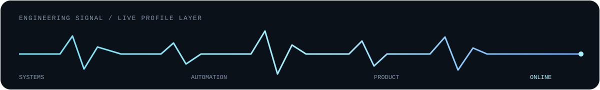

<picture>
  <source media="(prefers-color-scheme: dark)" srcset="./assets/hero-dark.svg">
  <source media="(prefers-color-scheme: light)" srcset="./assets/hero-light.svg">
  
</picture>

<br/>

<div align="center">

[](https://www.linkedin.com/in/egecagintepe/)
[](mailto:napryzon@gmail.com)

</div>

---

## 01 / BUILDING SYSTEMS

I work at the intersection of **electrical engineering, software architecture, automation and product design**.

My focus is less about isolated technologies and more about how complete systems behave: how components communicate, where workflows fail, what should be automated, and how complex infrastructure can stay understandable and usable.

<table>
<tr>
<td width="33%" valign="top">

### NovZon
**Digital publishing & media platform**

A multi-surface product ecosystem built around Django, asynchronous processing, real-time services and multiple purpose-specific frontends.

**Engineering themes**
- domain-oriented backend design
- Celery + Redis workloads
- Django / HTMX / React / Svelte / Astro
- real-time WebSocket features
- AI-assisted structured workflows
- DevSecOps & browser acceptance testing

[Explore the showroom →](https://github.com/egecagintepe/novzon-platform)

</td>
<td width="33%" valign="top">

### TRIAGE
**Disaster-response coordination system**

A hackathon-built emergency coordination platform designed around offline resilience, field operations and AI-assisted incident analysis.

**Engineering themes**
- FastAPI backend
- offline-first PWAs
- real-time synchronization
- deterministic AI fallbacks
- dispatch logic
- geospatial workflows

[View project →](https://github.com/egecagintepe/triage-disaster-response)

</td>
<td width="33%" valign="top">

### ZonDPI
**Windows network utility**

An open-source local system utility for mitigating DPI interference, TLS SNI blocking and DNS poisoning on Turkish ISP networks.

**Engineering themes**
- Windows service architecture
- WinDivert packet filtering
- local IPC
- Tauri desktop GUI
- CLI tooling
- zero-telemetry design

[View project →](https://github.com/egecagintepe/ZonDPI)

</td>
</tr>
</table>

---

## 02 / ENGINEERING PROFILE

<table>
<tr>
<td width="50%" valign="top">

### SOFTWARE & AUTOMATION

`Python` · `Django` · `FastAPI`  
`Node.js` · `JavaScript / TypeScript`  
`C / C++` · `C#`  
`LLM-assisted development`  
`Workflow automation`

</td>
<td width="50%" valign="top">

### SYSTEMS & INFRASTRUCTURE

`Linux` · `Docker` · `WSL2`  
`Redis` · `PostgreSQL`  
`Home / cloud server operations`  
`Networking`  
`System architecture`

</td>
</tr>
<tr>
<td width="50%" valign="top">

### ENGINEERING & HARDWARE

`Embedded Systems`  
`Altium Designer`  
`Proteus`  
`Electronics`  
`Power Systems`

</td>
<td width="50%" valign="top">

### PRODUCT & INTERFACE

`Figma` · `Adobe Photoshop`  
`Tailwind CSS` · `Google Stitch`  
`UI / UX`  
`Rapid prototyping`  
`Human-centered workflows`

</td>
</tr>
</table>

---

## 03 / HOW I BUILD

**System first. Interface included. Automation where it matters.**

I increasingly use AI as an engineering instrument for architecture exploration, implementation acceleration, testing and repetitive workflow automation — while keeping the system model, trade-offs and final technical decisions human-directed.

My preferred projects usually combine more than one domain:

```text
hardware / infrastructure
          │
          ▼
    system behavior
          │
          ├── automation
          ├── software
          ├── reliability
          └── interface
          │
          ▼
       product
```

---

## 04 / CURRENT DIRECTION

- **Systems engineering** — connecting software, infrastructure and hardware rather than treating them as isolated layers.
- **AI-augmented development** — using LLMs as force multipliers for implementation, analysis and automation.
- **Resilient architecture** — designing around failure modes, recovery paths and real operational constraints.
- **Product engineering** — caring about the interaction surface as much as the underlying implementation.
- **Engineering leadership** — translating ambiguous goals into executable systems and coordinated work.

---

## 05 / SIGNAL

<p align="center">
  
</p>

<div align="center">

**BUILD · AUTOMATE · ITERATE**

<sub>Electrical & Electronics Engineering · Systems · Software · Product</sub>

<br/><br/>

[LinkedIn](https://www.linkedin.com/in/egecagintepe/) ·
[Email](mailto:napryzon@gmail.com)

</div>
